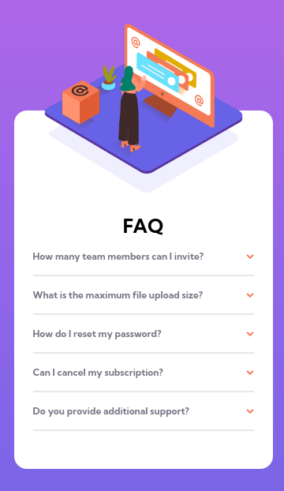

# Frontend Mentor - FAQ accordion card solution

This is a solution to the [FAQ accordion card challenge on Frontend Mentor](https://www.frontendmentor.io/challenges/faq-accordion-card-XlyjD0Oam).
## Table of contents

- [Overview](#overview)
  - [The challenge](#the-challenge)
  - [Screenshot](#screenshot)
  - [Links](#links)
- [My process](#my-process)
  - [Built with](#built-with)
  - [What I learned](#what-i-learned)
  - [Continued development](#continued-development)
  - [Useful resources](#useful-resources)
- [Author](#author)
- [Acknowledgments](#acknowledgments)

**Note: Delete this note and update the table of contents based on what sections you keep.**

## Overview

### The challenge

Users should be able to:

- View the optimal layout for the component depending on their device's screen size
- See hover states for all interactive elements on the page
- Hide/Show the answer to a question when the question is clicked

### Screenshot

**Desktop**


**Mobile**


### Links

- Solution URL: [faq-accordion-card-solution](https://www.frontendmentor.io/solutions/accordion-with-and-without-js-AvK2GFwVo)
- Live Site URL: [https://faq-accordioncard.netlify.app/](https://faq-accordioncard.netlify.app/)

## My process

### Built with

- Semantic HTML5 markup
- SCSS variables and mixin
- Flexbox
- CSS Grid (just to center the card)
- Mobile-first workflow

### What I learned

**css sibling selector**
```css
& + .answer{
    display: block;
  }
```

## Author

- Frontend Mentor - [@ibrahimisa](https://www.frontendmentor.io/profile/ibrahimisa)
- Twitter - [@ibrahim_isa274](https://www.twitter.com/ibrahim_isa274)


## Acknowledgments

I got the idea of how to position the illustration from [here](https://github.com/tihusky/faq-accordion)

